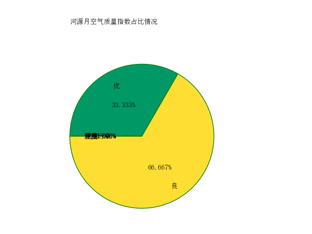
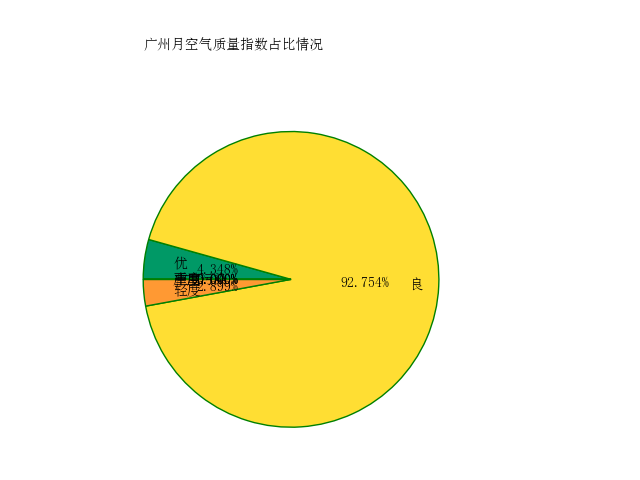
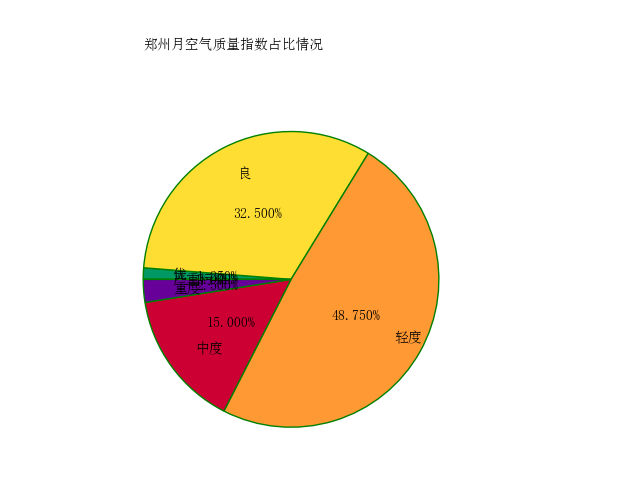

河源市、广州市、郑州市空气质量月数据分析

由此可见，河源市的环境质量还是不错的，大部分天气为良，优是最多的，占到了33.3%。广州空气质量良最多的城市，占到了92.75%，郑州却有中度和重度污染，其中重度污染占2.00%，重度污染占到了15.00%。

接下来生成南北方的空气质量数据图

南方城市有：

广东：广州，深圳，珠海，东莞，惠州，汕头，湛江，潮州，阳江，韶关，河源，佛山，海丰，梅州，茂名；

广西：南宁，桂林，梧州，柳州，百色，河池，贺州，钦州，北海，防城港；

海南：海口，三亚；

福建：福州，厦门，泉州，南平，漳州，三明；

云南：昆明，大理，曲靖，楚雄，昭通，保山，版纳，思茅，文山；

贵州：贵阳，六盘水，铜仁，凯里，安顺，遵义；

湖南：长沙，湘潭，株洲，常德，岳阳，吉首，冷水江；

江西：南昌，九江，赣州，吉安，鹰潭，景德镇，萍乡；

浙江：杭州，宁波，湖州，嘉兴，绍兴，舟山，温州，台州，金华，丽水；

四川：成都，绵阳，南充，自贡，峨眉山，宜宾，泸州，康定，阿坝，西昌，攀枝花；

重庆：重庆，涪陵，万州；

湖北：武汉，宜昌，襄樊，鄂州，荆州，黄石，孝感，沙市，咸宁；

安徽：合肥，芜湖，安庆，黄山，贵池，铜陵，宣城，马鞍山，巢湖，滁州；

江苏：南京，镇江，扬州，泰州，常州，无锡，苏州，南通，盐城；

上海。

北方城市有：

北京、天津、石家庄、承德、张家口、唐山、秦皇岛、保定、廊坊、沧州、衡水、邢台、邯郸、安阳、开封、洛阳、郑州、南阳、三门峡、登封、信阳、商丘、大同、太原、榆次、忻州、朔州、长治、大连、沈阳、锦州、凌源、鞍山、阜新、吉林、长春、伊春、白城、丹东、哈尔滨、齐齐哈尔、满洲里、漠河、黑河、七台河、牡丹江、鹤岗、旅顺、二连浩特、包头、呼和浩特、锡林浩特、乌兰浩特、集宁、德州、济南、泰安、聊城、泰州、徐州、青岛、烟台、潍坊、淄博、延安、西安、宝鸡、榆林、汉中、咸阳、离石、介休、银川、石嘴山、兰州、天水、酒泉、张掖、嘉峪关、玉门、西宁、格尔木、乌鲁木齐、喀什、善僐、伊犁、石河子、吐鲁番

这是月空气质量图，日空气质量还在爬。