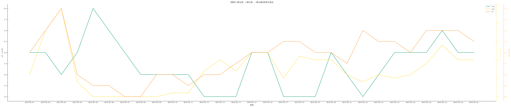
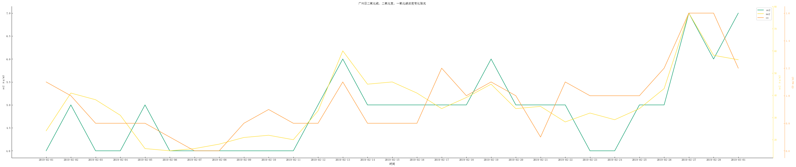
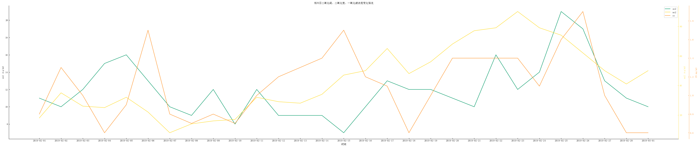
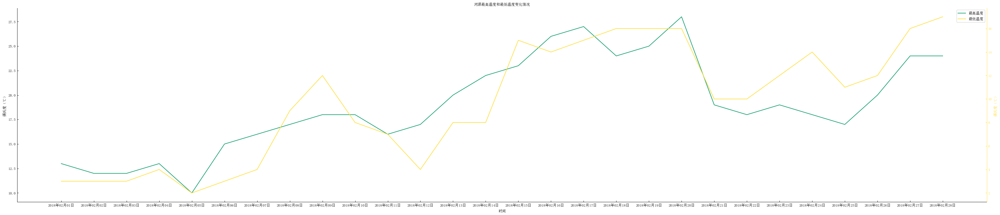
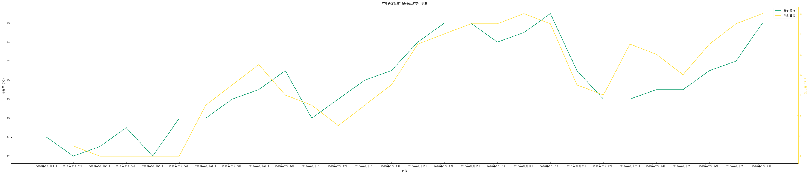
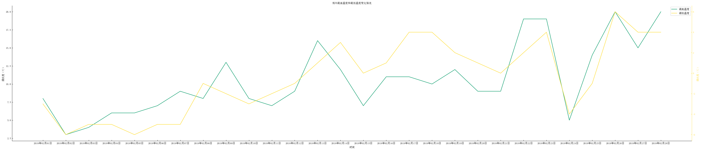

河源市、广州市、郑州市空气质量月数据分析

由此可见，河源市的环境质量还是不错的，大部分天气为良，优是最多的，占到了33.3%。广州空气质量良最多的城市，占到了92.75%，郑州却有中度和重度污染，其中重度污染占2.00%，重度污染占到了15.00%。

这是月空气质量图，日空气质量还在爬。

现在查阅了各大城市的日空气质量数据，大致看了一下可视化后的全部图片，北方的天气还是没有南方好。

以下是2019年2月河源、广州和郑州之间的污染物浓度变化情况

接下来三张是2018年2月河源、广州和郑州之间的温度变化情况

